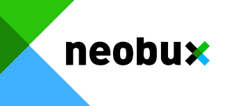

# neoboot
 

Is a boot for Neobux p-t-c 

Para esse projeto é proposto um boot completo para que não seja preciso a interação diária com o site que oferece meios de receber por visualização de anúncios e clicks.

***Checkpoints***:

 - [ ] Clicar
 - [ ] Clicar em seletores
 - [ ] procurar seletores
 - [ ] varredura de sites
 - [ ] teste em sites reais
 - [ ] captcha

***Extras***

 - [ ] função "webcrowley"
 - [ ] login
 - [ ] Database api.

## Tecnologia

 - Javascripto
 - Node.js
